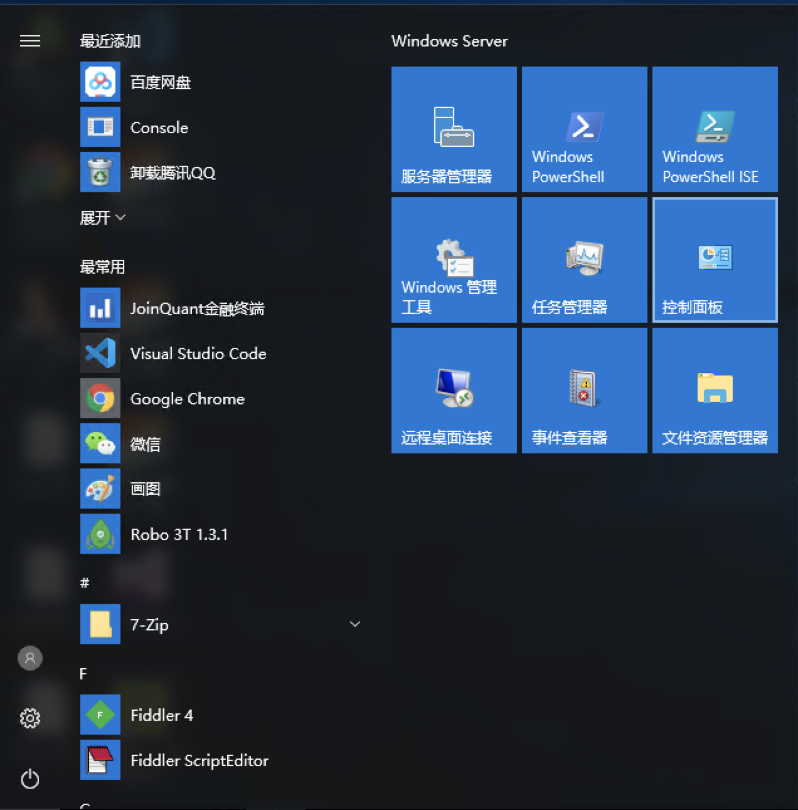
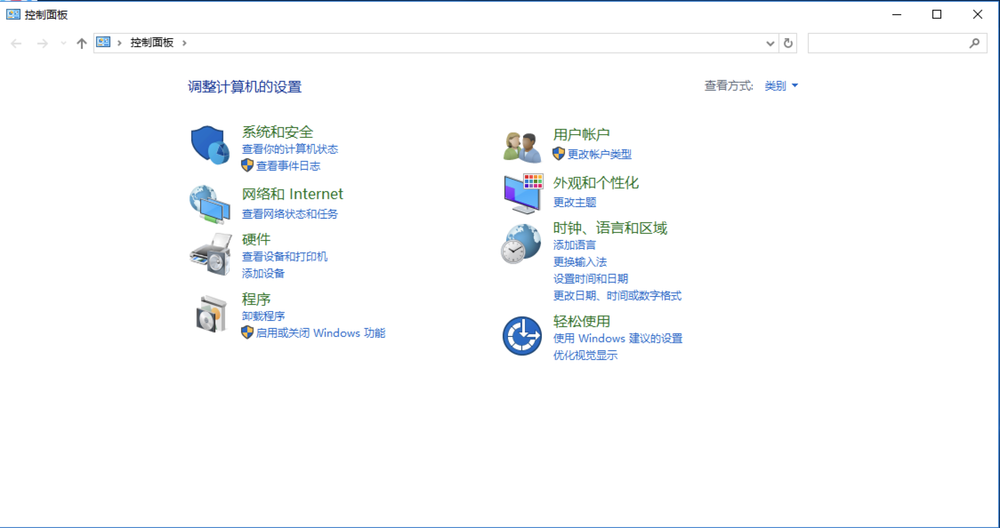
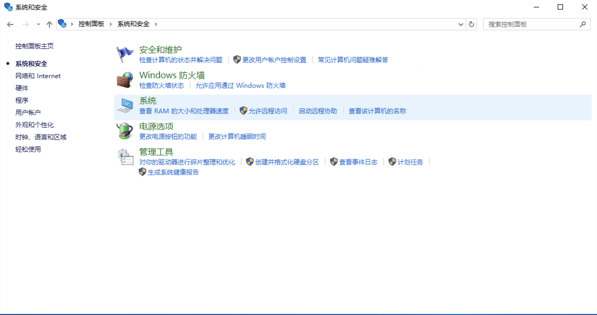
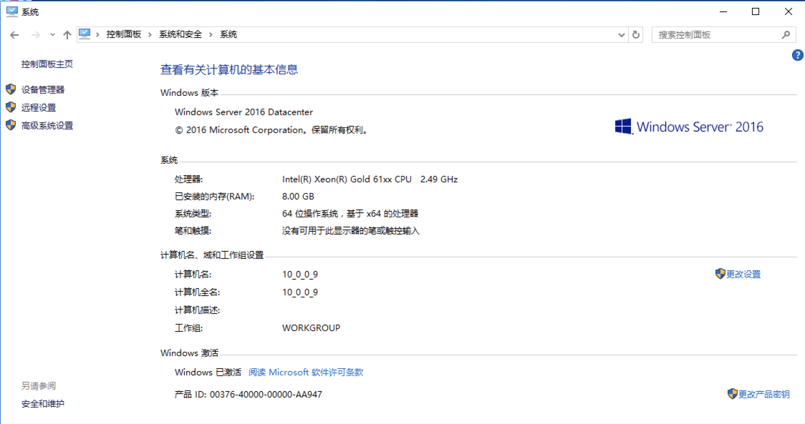
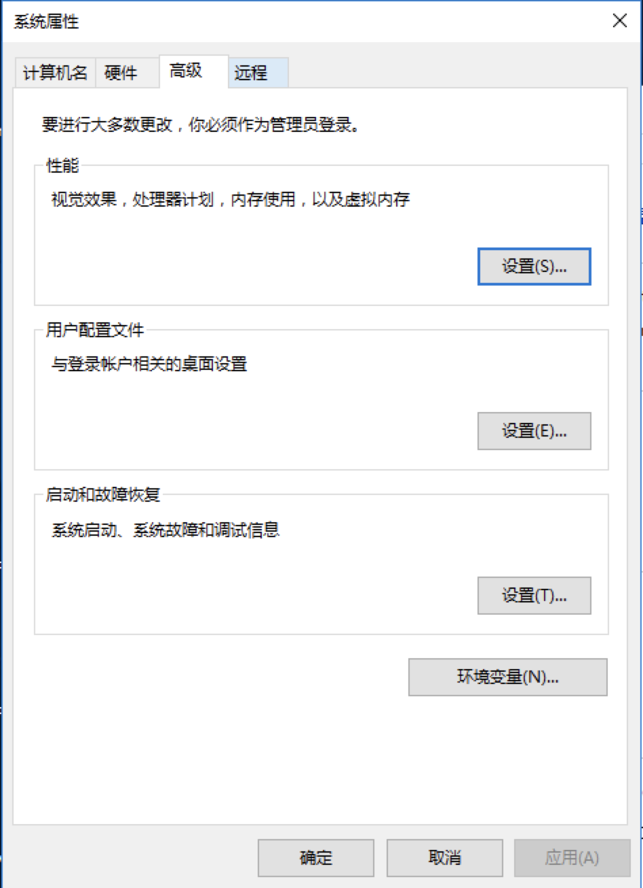
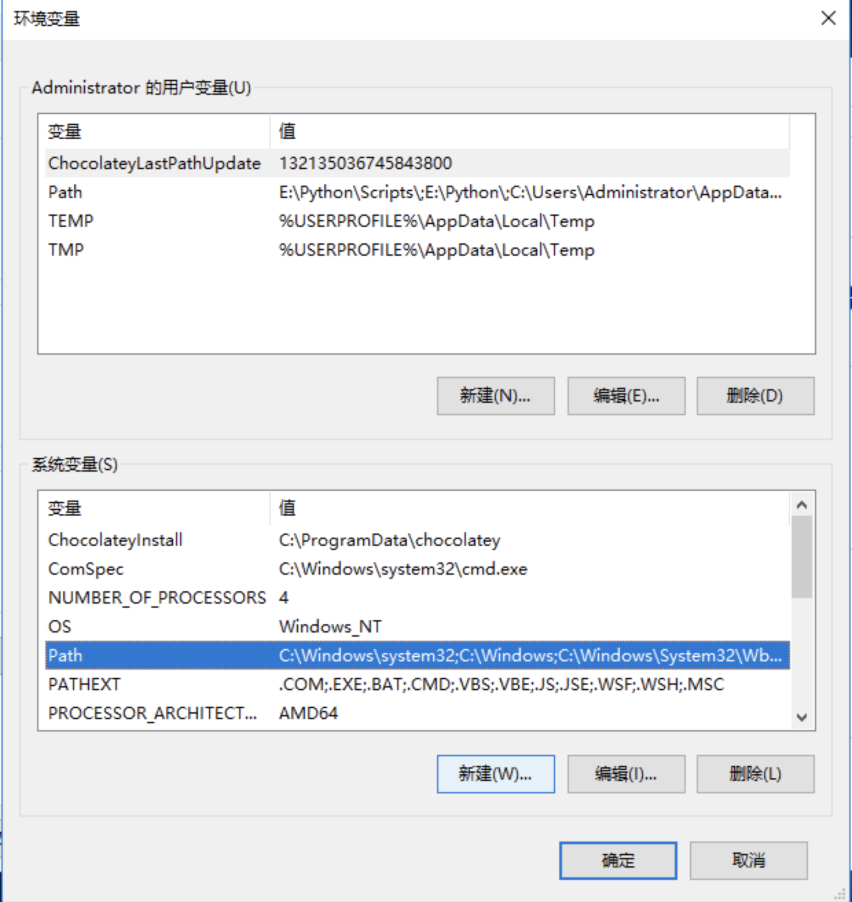
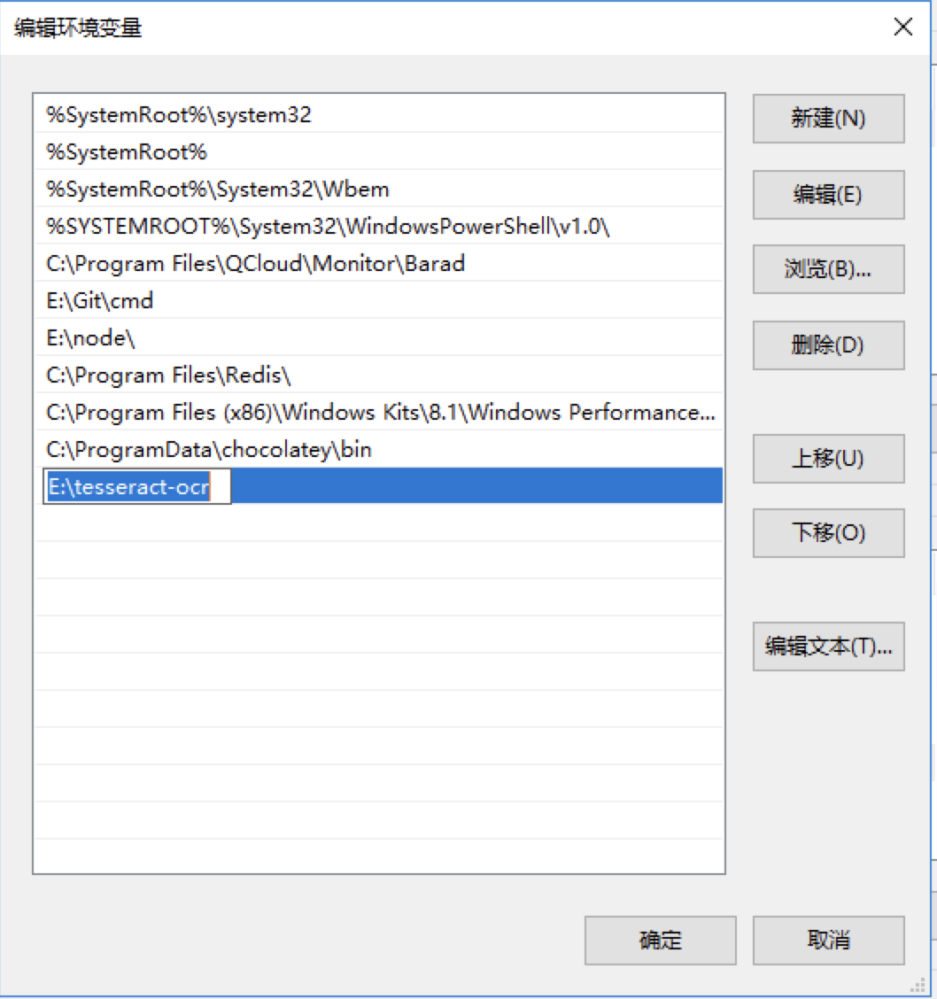
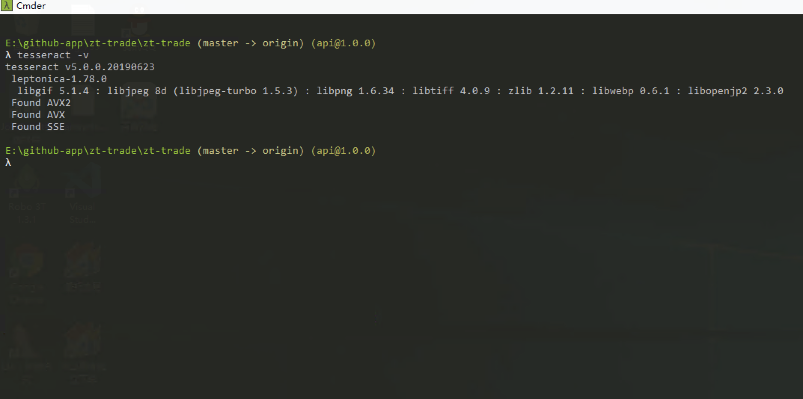

# 安装tesseract

tesseract是一个开源ocr引擎 用来自动登录时处理验证码 

免安装版已包含 只需要参考以下流程手动配置下环境变量

#### 配置环境变量

##### 1. 我的电脑 - 控制面板

##### 2. 系统与安全

##### 3. 系统

##### 4. 高级系统设置

##### 5. 系统属性 - 环境变量

##### 6. 系统变量 - Path - 编辑

##### 7. 新建 输入解压 zt-trade/tesseract-ocr 的安装目录 点击确定 
##### 安装目录示例 d:\zt-trade\tesseract-ocr

##### 8. 重启cmder 命令行输入 tesseract -v 如果正常显示版本信息则说明 tesseract 配置成功了

至此 tesseract 安装完毕

